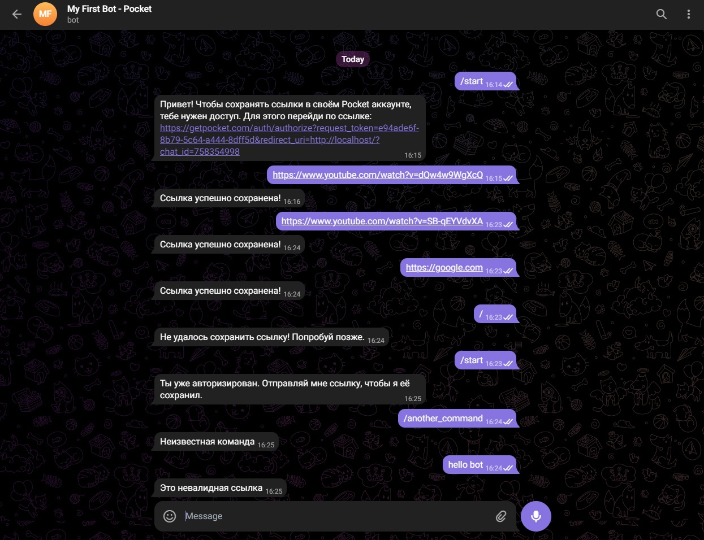
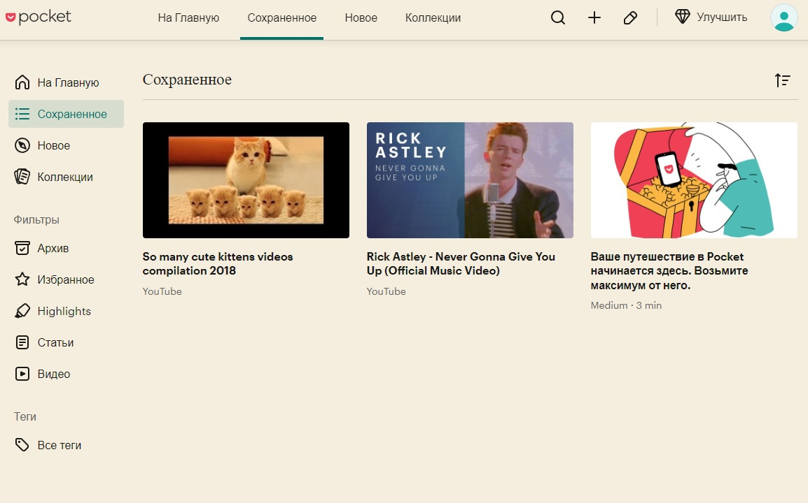

# My first Pocketer Telegram-bot

# Телеграм бот для сохранения ссылок в приложении [Pocket](https://getpocket.com/ru/home?src=navbar)

## Список используемых технологий:

* [BoltDB](https://github.com/boltdb/bolt/...) - NoSQL DataBase BoltDB
* [Docker](https://www.docker.com/) - Docker
* [viper](https://github.com/spf13/viper) - Работа с файлами конфигурации
* [GetPocket](https://github.com/zhashkevych/go-pocket-sdk) - GetPocket API Golang SDK

## Для запуска приложения:

``` bash
make build-image
make start-container
```

## Пример работы бота:



## Результат сохранения ссылок:

